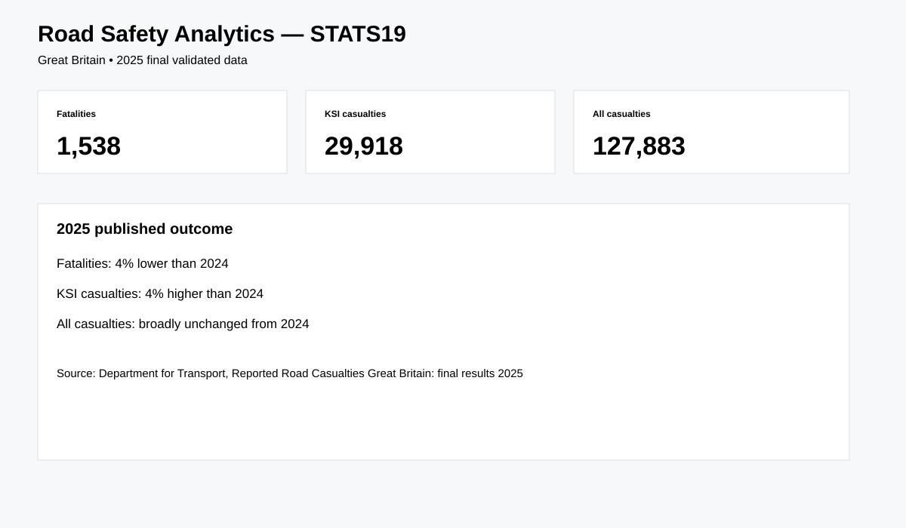

# Road Safety Analytics — STATS19

Real-world UK Data Analyst project using the Department for Transport's STATS19 road casualty data.

## Business question
Where, when and under what conditions are serious road casualties concentrated, and how does risk vary by road type, speed limit, urban/rural setting and geography?

## Source
Department for Transport — Road Safety Open Data. The latest final validated full year is 2025. The source contains record-level collision, vehicle and casualty files for Great Britain. [Official source](https://www.gov.uk/government/statistical-data-sets/road-safety-open-data)

## Verified headline facts from the 2025 final release
- **1,538 fatalities**
- **29,918 killed or seriously injured (KSI) casualties**
- **127,883 casualties of all severities**
- Fatalities were **4% lower** than 2024, while KSI casualties were **4% higher**.

These are official published figures; the project analysis script downloads the underlying collision CSV and calculates additional breakdowns locally.

## Tools
Python • pandas • SQL/SQLite • Matplotlib • Power BI-ready outputs

## Analysis
- Severity and casualty trends
- Urban vs rural comparison
- Road class and speed-limit analysis
- Month/day/time patterns
- Police-force/geographic comparison
- Serious-casualty concentration

## Reproducibility
```bash
pip install -r requirements.txt
python src/download_data.py
python src/analyze.py
```

The raw 2025 CSV is deliberately not committed because the official file is ~19 MB. The script downloads it directly from DfT.

## Dashboard preview


