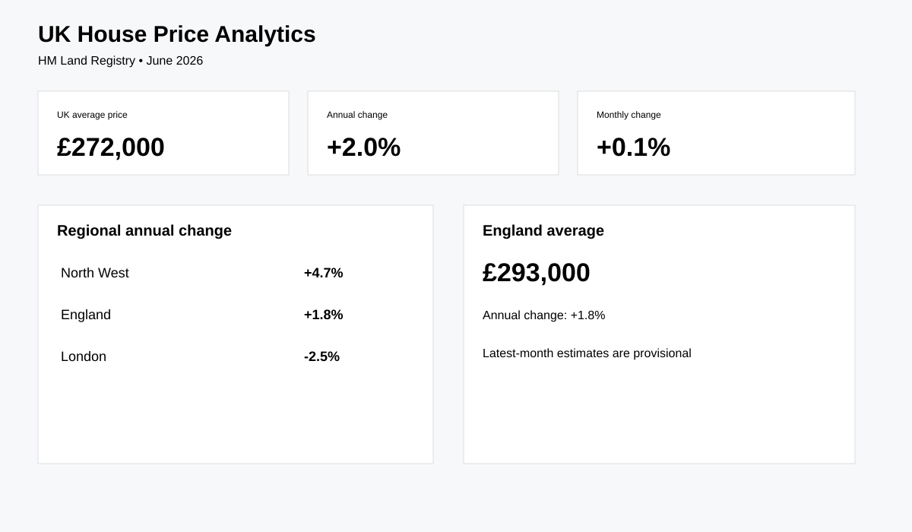

# UK House Price & Affordability Analytics

Real-world Data Analyst project using HM Land Registry's UK House Price Index.

## Business question
How are UK house prices changing across countries and English regions, and where is price growth diverging from the national trend?

## Source
HM Land Registry — UK House Price Index. June 2026 is the latest release used for the portfolio snapshot. [Official source](https://www.gov.uk/government/statistics/uk-house-price-index-for-june-2026)

## Verified June 2026 facts
- UK average property price: **£272,000**
- UK annual price change: **+2.0%**
- UK monthly price change: **+0.1%**
- England average: **£293,000**, annual change **+1.8%**
- North West annual growth: **+4.7%**
- London annual change: **-2.5%**

## Analysis
- Regional price growth
- Country comparison
- Monthly vs annual change
- Property-type analysis
- Long-run price index trend
- Regional variance and outlier detection

## Reproducibility
```bash
pip install -r requirements.txt
python src/download_data.py
python src/analyze.py
```

## Dashboard preview


