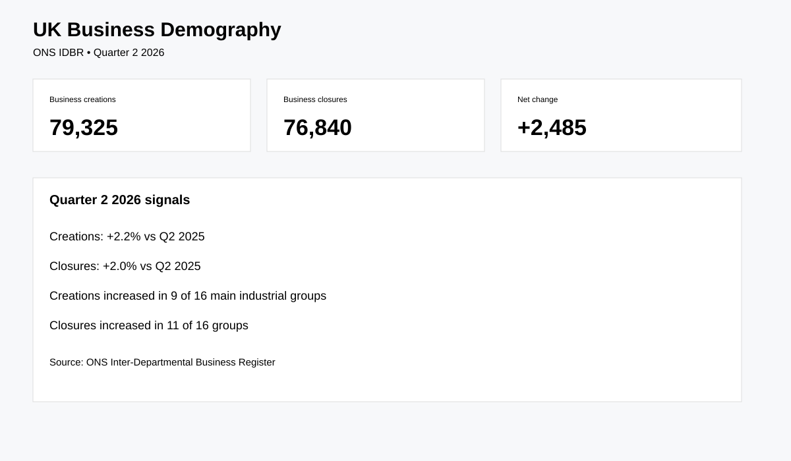

# UK Business Births, Closures & Survival

Real-world ONS Data Analyst project using the Inter-Departmental Business Register (IDBR).

## Business question
Where are businesses being created and closed, and how do these patterns vary by industry and geography?

## Source
Office for National Statistics — Business demography, quarterly UK. [Official source](https://www.ons.gov.uk/businessindustryandtrade/business/activitysizeandlocation/datasets/businessdemographyquarterlyexperimentalstatisticsuk)

## Verified Q2 2026 facts
- **79,325** business creations
- **76,840** business closures
- Creations were **2.2% higher** than Q2 2025
- Closures were **2.0% higher** than Q2 2025
- Creations increased in **9 of 16** main industrial groups
- Closures increased in **11 of 16** groups

## Analysis
- Net business creation
- Industry birth/death rates
- Regional patterns
- Quarterly trends
- Survival analysis using the annual ONS dataset
- Industry concentration and change

## Reproducibility
```bash
pip install -r requirements.txt
python src/download_data.py
python src/analyze.py
```

## Dashboard preview


