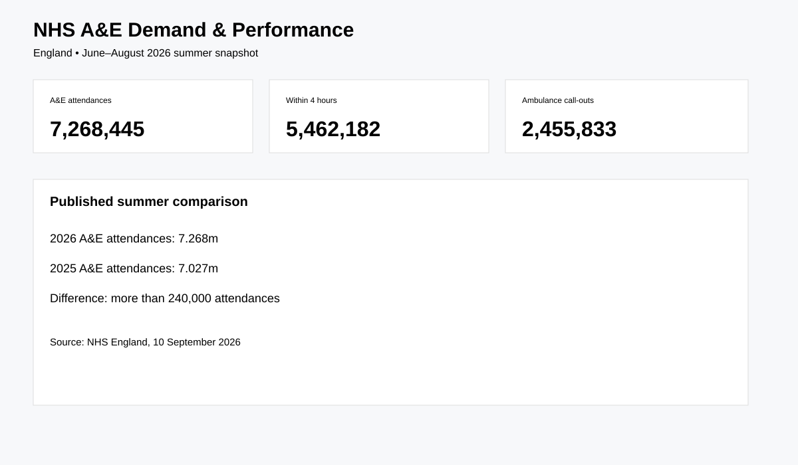

# NHS A&E Demand & Performance

Real-world Data Analyst project using NHS England monthly A&E activity data.

## Business question
How is emergency demand changing, and how does provider performance compare against activity volumes?

## Source
NHS England — A&E Attendances and Emergency Admissions 2026-27. [Official source](https://www.england.nhs.uk/statistics/statistical-work-areas/ae-waiting-times-and-activity/ae-attendances-and-emergency-admissions-2026-27/)

## Verified summer 2026 facts
- **7,268,445** A&E attendances across June–August 2026
- **5,462,182** within-four-hours activity
- **2,455,833** ambulance call-outs
- Summer 2026 attendances were more than **240,000 higher** than the comparable 2025 period.

## Analysis
- Monthly A&E demand
- Four-hour performance
- Emergency admissions
- Provider volume/performance comparison
- High-volume provider analysis

## Reproducibility
```bash
pip install -r requirements.txt
python src/download_data.py
python src/analyze.py
```

## Dashboard preview


