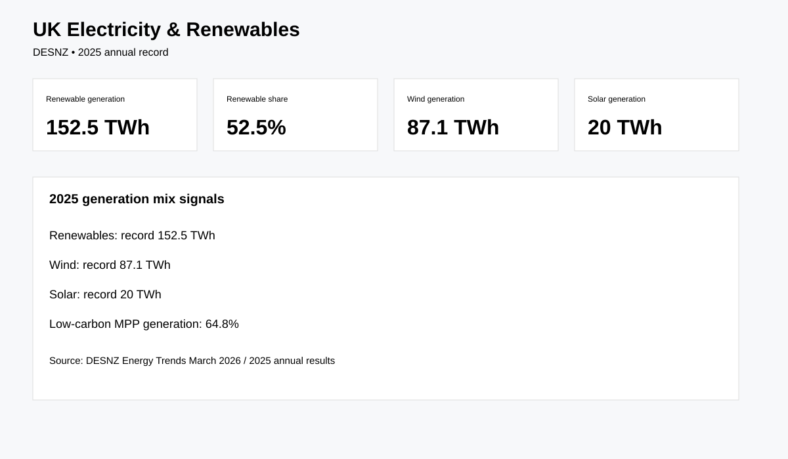

# UK Electricity Generation & Renewables

Real-world energy analytics using Department for Energy Security and Net Zero Energy Trends data.

## Business question
How is the UK's electricity generation mix changing, and how quickly are renewable sources becoming a larger part of generation?

## Source
DESNZ — Energy Trends / UK electricity and renewables tables. [Official electricity data](https://www.gov.uk/government/statistics/electricity-section-5-energy-trends)

## Verified 2025 facts
- Renewable technologies generated a record **152.5 TWh** in 2025.
- Renewables reached a record **52.5%** of electricity generation.
- Wind generated a record **87.1 TWh**.
- Solar generation reached a record **20 TWh**.
- Low-carbon generation accounted for **64.8%** of Major Power Producer generation in 2025.

## Analysis
- Generation by fuel
- Renewable share trend
- Wind/solar/hydro comparison
- Capacity vs generation
- Quarterly and annual growth
- Low-carbon vs fossil mix

## Reproducibility
```bash
pip install -r requirements.txt
python src/download_data.py
python src/analyze.py
```

## Dashboard preview


