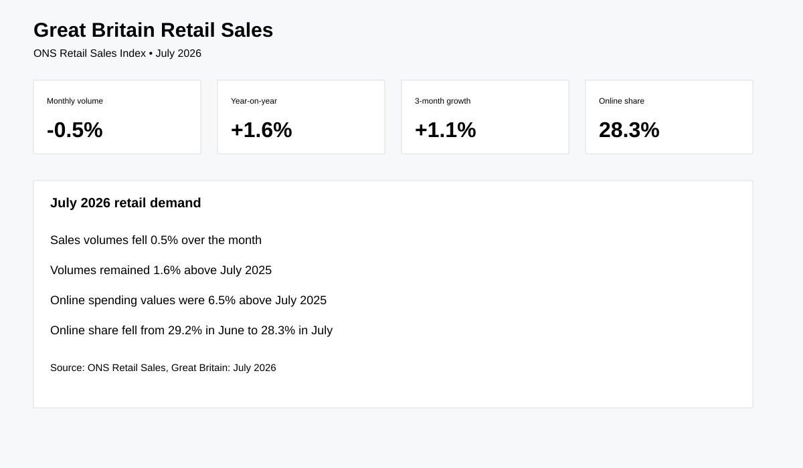

# Great Britain Retail Sales Analytics

Real-world ONS Data Analyst project using the Retail Sales Index.

## Business question
What is happening to retail demand, and how do online and physical retail channels differ over time?

## Source
Office for National Statistics — Retail Sales Index. The July 2026 release is used as the current portfolio snapshot. [Official dataset](https://www.ons.gov.uk/businessindustryandtrade/retailindustry/datasets/retailsales)

## Verified July 2026 facts
- Retail sales volumes fell **0.5%** month-on-month.
- Volumes rose **1.6%** compared with July 2025.
- Volumes rose **1.1%** in the three months to July 2026 compared with the three months to April.
- Online spending values were **6.5% higher** than July 2025.
- Online sales represented **28.3%** of total sales in July 2026.

## Analysis
- Retail volume/value trends
- Online vs total sales
- Sector performance
- Monthly and rolling-three-month growth
- Year-on-year comparisons
- Seasonal volatility

## Reproducibility
```bash
pip install -r requirements.txt
python src/download_data.py
python src/analyze.py
```

## Dashboard preview


